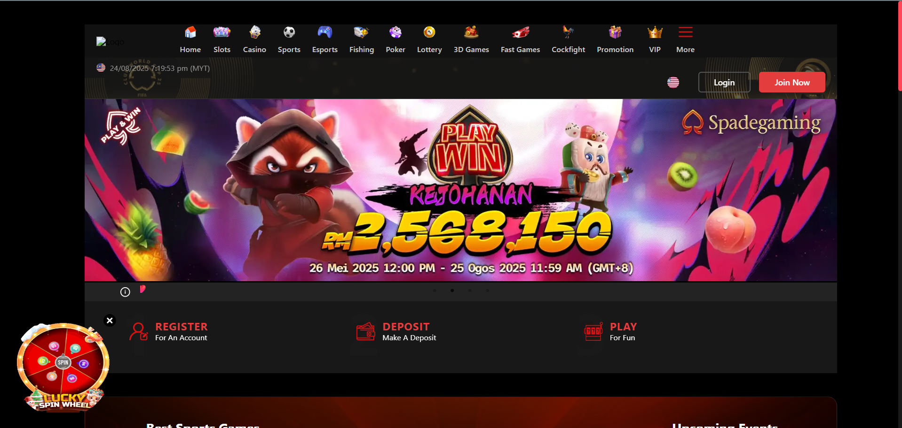
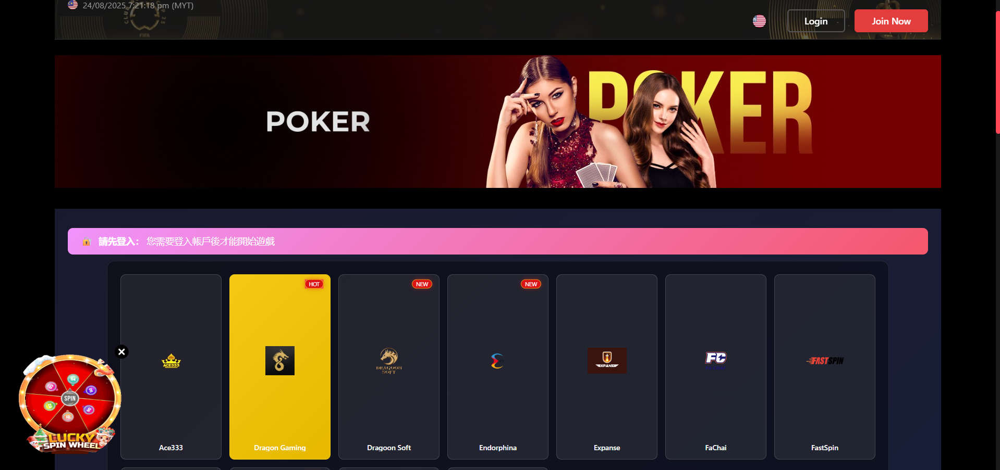
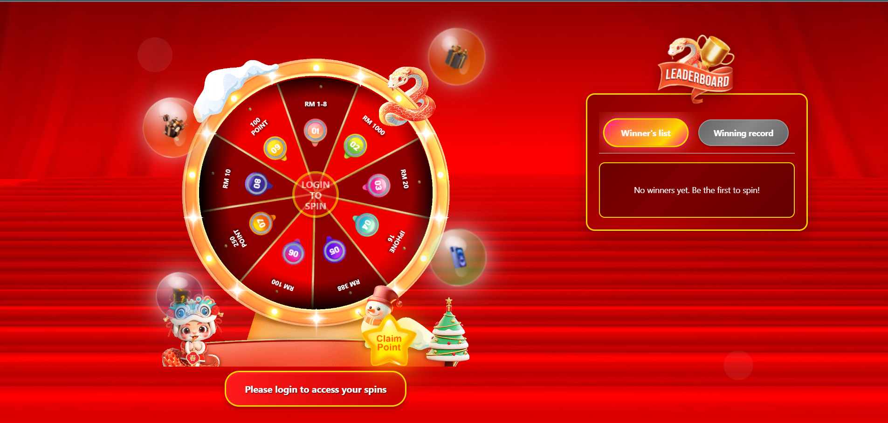
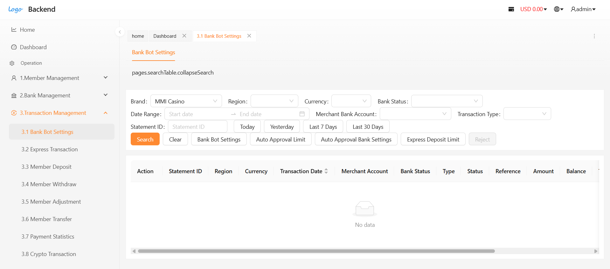
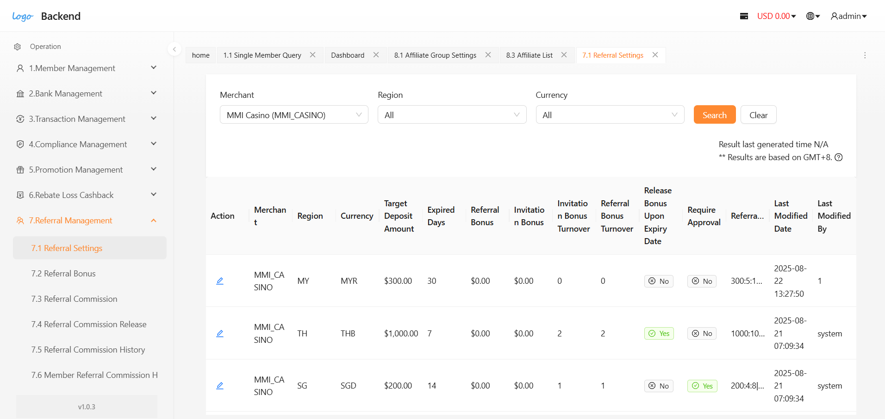
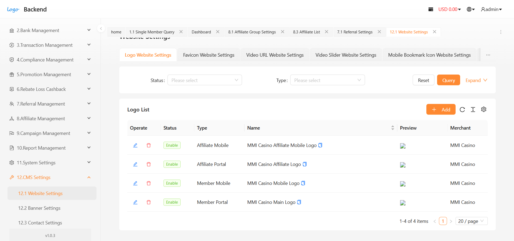
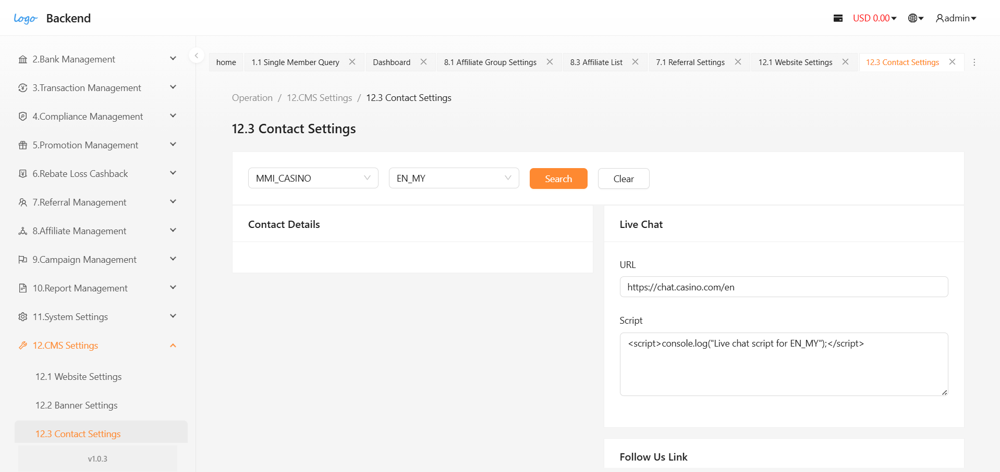

# 🎰 Casino Gaming Platform - Sales Page

A modern, responsive sales page for a premium casino gaming platform built with React.js. Features a professional dark red/black/gold color scheme inspired by luxury casino aesthetics.

## 🎮 About Our Platform

Welcome to our comprehensive casino gaming platform that provides cutting-edge gaming solutions for operators and players alike. Our platform offers:

- **Game88**: A comprehensive gaming interface featuring 500+ slot games, live casino experiences, and sports betting options
- **CRM88**: Advanced customer relationship management system designed specifically for casino operations
- **Affiliate Program**: Lucrative partnership opportunities with up to 60% revenue sharing
- **24/7 Support**: Round-the-clock technical and customer support
- **Security & Compliance**: Industry-standard security measures and regulatory compliance

## 📸 Platform Screenshots

### Game88 - Gaming Interface

*Our flagship gaming platform featuring hundreds of slot games and live casino experiences*

### CRM88 - Management System

*Advanced CRM system for managing player relationships and casino operations*

### Additional Platform Views

*Comprehensive feature overview of our gaming solutions*


*User-friendly dashboard for seamless gaming experience*


*Powerful admin panel for casino operators*


*Fully responsive mobile gaming interface*


*Real-time analytics and reporting tools*


*Advanced security and compliance features*

## 🎮 Features

- **Modern Design**: Dark casino-themed color scheme with red gradients and gold accents
- **Responsive Layout**: Optimized for desktop, tablet, and mobile devices
- **Professional Sections**:
  - Header with navigation
  - Hero section with key features
  - Products showcase
  - About us with statistics
  - Contact information and form
  - Professional footer

## 🎨 Design Theme

The website uses a professional casino color palette:
- **Primary Colors**: Deep reds (#dc2626, #b91c1c, #991b1b)
- **Background**: Black to dark red gradients (#000000, #1a0000, #330000)
- **Accents**: Gold (#ffd700, #fbbf24)
- **Text**: White and light gray for contrast

## 🚀 Quick Start

### Prerequisites
- Node.js (version 14 or higher)
- npm or yarn

### Installation

1. Clone the repository:
```bash
git clone https://github.com/yourusername/casino-sales-page.git
cd casino-sales-page
```

2. Install dependencies:
```bash
npm install
```

3. Start the development server:
```bash
npm start
```

4. Open [http://localhost:3000](http://localhost:3000) to view it in the browser.

## 📦 Deployment

### Deploy to GitHub Pages

1. Update the `homepage` field in `package.json` with your GitHub Pages URL:
```json
"homepage": "https://yourusername.github.io/casino-sales-page"
```

2. Deploy to GitHub Pages:
```bash
npm run deploy
```

### Build for Production

To create a production build:
```bash
npm run build
```

## 🛠️ Built With

- **React.js** - Frontend framework
- **CSS3** - Styling with gradients and animations
- **Create React App** - Build tool and development server
- **GitHub Pages** - Deployment platform

## 📱 Responsive Design

The website is fully responsive and optimized for:
- Desktop (1200px+)
- Tablet (768px - 1199px)
- Mobile (< 768px)

## 🎯 Components

- `Header` - Navigation bar with company branding
- `Hero` - Main banner with call-to-action
- `Products` - Gaming products showcase
- `About` - Company information and statistics
- `Contact` - Contact form and information
- `Footer` - Links and company details

## 🎨 Customization

### Colors
Update the CSS variables in each component's CSS file to change the color scheme.

### Content
Modify the component files in `src/components/` to update content, images, and information.

### Styling
Each component has its own CSS file for easy customization and maintenance.

## 📄 License

This project is licensed under the MIT License.

## 🤝 Contributing

1. Fork the repository
2. Create a feature branch
3. Commit your changes
4. Push to the branch
5. Open a pull request

## 📧 Contact

For any questions or suggestions, please contact us through the website's contact form.

---

Built with ❤️ for the gaming industry